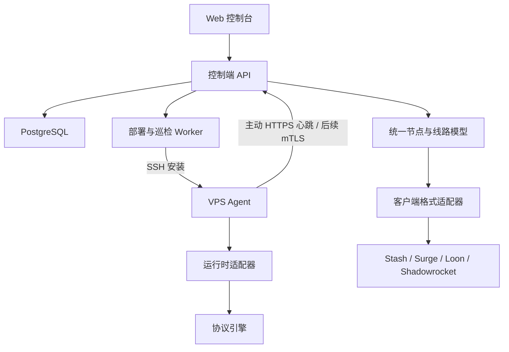

# 星渡开发计划

状态：六个近期方向均已开始实现，仍未达到公网 SaaS 正式发布标准。当前实现、验证证据与剩余工作见 [本轮交付状态](IMPLEMENTATION-STATUS.md)。

已有多租户控制台、机器主动接入/SSH 安装、五种协议部署、节点与订阅。协议数据面已完成 Ubuntu / Debian / Amazon Linux 的本地容器验收；真实 VPS/EC2 和客户端 App 验收仍待完成。新增部署预检、节点重启与服务状态、客户端导出适配、账户安全、组织所有权转移、配额审计及备份恢复。

## 产品目标与边界

建设独立的 VPS 与线路自动化管理平台，兼容 Stash、Surge、Loon、Shadowrocket 等客户端。首版面向个人及小团队，采用支持自托管的 SaaS 架构，组织作为租户，支持多用户协作与已有 VPS 接入。

项目采用 [MIT 许可证](../LICENSE)，允许免费商用；源码仓库未来用于公开协作和发布，不采用仅公开二进制的产品模式。真实运维配置、凭据和用户数据不进入源码仓库。

客户端格式和服务端引擎分别适配，不因使用某客户端而强制绑定某引擎。首版用最少的引擎覆盖经验证的协议组合。

## 核心体验

添加服务器 → 选择模板 → 自动部署 → 实际协议探测 → 发布客户端订阅。

机器安装与安全边界见 [机器接入设计](MACHINE-ACCESS.md)。

主要页面：概览、服务器、线路、订阅、部署记录、组织与成员。详细租户边界见 [SaaS 设计](SAAS.md)。

## 架构



控制端保存期望配置、任务与配置版本。Agent 执行受限、可审计的管理操作，控制端不可用时继续运行最后一版有效配置。

建议技术栈：React + TypeScript、Go API/Worker/Agent、PostgreSQL 持久化任务、SSE 进度推送、Linux systemd、Docker Compose 自托管。先做模块化单体。

代码布局（业务目录按实现进度创建，暂不堆放空目录）：

```text
apps/web/
cmd/server/
cmd/worker/
cmd/agent/
internal/hosts/
internal/routes/
internal/deployments/
internal/subscriptions/
internal/credentials/
internal/adapters/runtimes/
internal/adapters/clients/
migrations/
deploy/
docs/
```

## 数据模型

| 对象 | 职责 |
| --- | --- |
| User / Organization / Membership | 全局用户、组织租户、成员角色 |
| Invitation | 限时单次链接、固定角色、可撤销 |
| Host | 地址、系统、架构、标签、Agent 身份和状态 |
| Service | 引擎版本、监听端口、协议参数与所属服务器 |
| Route | 入口、中转、出口及依赖关系 |
| Credential | 访问凭据、轮换与撤销 |
| Subscription | 线路集合、客户端格式、可撤销访问令牌 |
| Deployment | 期望版本、执行步骤、结果和回滚记录 |
| ProbeResult | 探测位置、协议连通性、延迟和实际出口 |

首版支持直连与单层中转，多跳只预留模型扩展空间。中转优先由服务器实现，客户端连接普通入口。

## 客户端兼容

建立客户端版本 × 协议 × 传输方式 × 参数兼容矩阵。

- 支持项正常输出，不兼容项明确显示并拒绝输出该订阅，避免悄悄漏掉节点。
- 不静默丢弃关键参数，不自动降低安全配置。
- 首版优先节点、订阅、分享链接；完整分流规则与 DNS 模板后置。
- 验收需要真实客户端导入并连接，不能仅用配置生成成功代替。

## 部署可靠性

检查系统与端口 → 准备引擎、证书和凭据 → 生成与校验配置 → 保存上一版 → 应用 → 进程检查 → 外部真实协议与出口验证 → 发布订阅。

- 任务步骤持久化，支持超时、租约、幂等重试和中断恢复。
- 对同一主机的冲突操作串行化，并防止过期执行者覆盖新配置。
- 部署绑定配置版本，失败恢复上一版有效配置。
- 分别呈现进程运行、节点可连接、整条线路可用三类状态。
- 防火墙仅管理星渡规则，保留 SSH/管理链路。
- 卸载和回滚考虑共享引擎、证书与其他线路依赖。
- 私钥和令牌不进入日志；备份中的敏感字段也需加密。
- Agent 使用一次性注册令牌和独立设备身份，支持撤销与证书轮换。

## 开发阶段与验收

| 阶段 | 内容 | 验收 |
| --- | --- | --- |
| P0 能力验证 | 核实候选引擎、Linux 运行与许可、四客户端兼容范围 | 确认至少一种共同协议的部署与四客户端实连；产出能力矩阵并确定首版引擎与协议集合 |
| P1 服务器接入 | 用户登录、组织与成员、VPS 管理、SSH 引导安装、Agent 注册与心跳 | 干净 VPS 可接入，重启后恢复，离线状态准确 |
| P2 单机闭环 | 模板、配置校验、证书、持久化任务、回滚 | 空白 VPS 到节点全流程自动化，注入失败后可恢复 |
| P3 客户端订阅 | 四客户端适配、分享链接、订阅令牌 | 支持组合真实连接，不兼容项清楚提示，令牌可撤销 |
| P4 中转线路 | 双 VPS 编排、依赖顺序、完整线路探测 | 入口与出口正确，单端故障能定位，变更失败可恢复 |
| P5 开源发布 | 升级、告警、备份恢复、安装文档、LICENSE、CI 与发布流程 | 可复现构建；升级失败可恢复；发布包和历史不含私密数据 |

首个里程碑：接入一台干净 VPS，一键部署已验证的线路，生成四类客户端订阅，证明配置更新失败后能够恢复。

## 首版暂缓

自动购买 VPS、云厂商计费、商业套餐、支付、任意多跳、自动最优线路、拖拽拓扑、完整分流规则托管、大范围自动修复。

## 开源发布前事项

- 已选定 MIT 并添加 LICENSE；发布前检查依赖、协议引擎及二进制再分发要求，并在分发包中保留所需版权和许可声明。
- 确定 GitHub 组织与公开仓库地址，不沿用 Stash 的项目身份。
- 确认贡献者公开身份与仓库级 Git 作者设置；noreply 只隐藏邮箱，不隐藏关联账号。
- 在首次公开前检查 Git 历史、构建元数据、绝对路径、配置示例和 CI 日志。
- 配置私密漏洞报告渠道、最小权限 CI、发布校验和及可验证构建来源。
- 注册并配置 xingdu.app；组织名、域名归属和联系邮箱均需实际核实。

## 待确定

已确定首版使用 sing-box，覆盖 Trojan、VLESS、VMess、Hysteria 2、TUIC。仍需确定公网测试 VPS、DNS/ACME 接入方式、通知与邮件提供商、实际客户端版本和公开发布环境。
