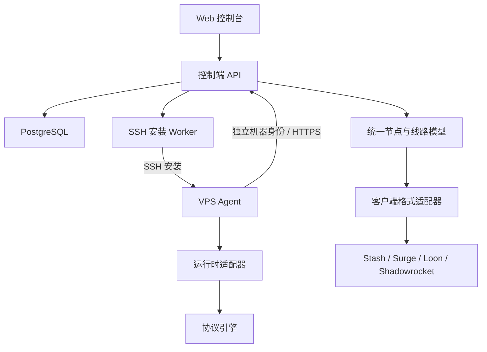

# 星渡开发计划

本页区分产品目标与后续工作。当前代码、发布包与验收证据统一记录于
[功能状态](IMPLEMENTATION-STATUS.md)，不再用阶段目标代替交付说明。
Xingdu Cloud 已提供托管入口；已实现能力包括多租户、机器接入、协议部署、
配置版本恢复、单层 TCP 中转、订阅路由模板、组织计费及发布 CI。
公网恢复、公共 CA 与各客户端组合仍需分别验收。

## 产品目标与边界

建设独立的 VPS 与线路自动化管理平台，兼容 Stash、Surge、Loon、Shadowrocket 等客户端。首版面向个人及小团队，采用支持自托管的 SaaS 架构，组织作为租户，支持多用户协作与已有 VPS 接入。

项目采用 [MIT 许可证](../LICENSE)，允许免费商用；源码仓库用于公开协作和发布，不采用仅公开二进制的产品模式。真实运维配置、凭据和用户数据不进入源码仓库。

客户端格式和服务端引擎分别适配，不因使用某客户端而强制绑定某引擎。首版用最少的引擎覆盖经验证的协议组合。

## 核心体验

添加服务器 → 选择模板 → 自动部署 → 实际协议探测 → 发布客户端订阅。

机器安装与安全边界见 [机器接入设计](MACHINE-ACCESS.md)。

主要页面：概览、服务器、线路、订阅、部署记录、组织与成员。详细租户边界见 [SaaS 设计](SAAS.md)。

## 架构



控制端保存期望配置、任务与配置版本。Agent 执行受限、可审计的管理操作，控制端不可用时继续运行最后一版有效配置。

当前技术栈：React + TypeScript、Go API/Worker/Agent、PostgreSQL 持久化任务、Linux systemd、Docker Compose 自托管，采用模块化单体。外部探测和自动证书使用独立运营者进程。

当前主要代码布局：

```text
apps/web/                  官网与控制台
cmd/                       API、Worker、Agent 及运营工具
internal/httpapi/          认证与管理 API
internal/storage/          事务、RLS 与 migrations/
internal/machine/          机器接入、SSH 和升级契约
internal/agent/            机器任务与系统服务操作
internal/protocol/         协议配置与运行时规格
internal/subscription/     客户端导出及路由模板
internal/billing/          Stripe 计费
internal/certificates/     ACME 与 DNS 集成
deploy/                    部署配置
docs/                      操作说明与验收边界
```

## 数据模型

| 对象 | 职责 |
| --- | --- |
| User / Organization / Membership | 全局用户、组织租户、成员角色 |
| Invitation | 限时单次链接、固定角色、可撤销 |
| Host | 地址、系统、架构、标签、Agent 身份和状态 |
| Service | 引擎版本、监听端口、协议参数与所属服务器 |
| Route | 入口、中转、出口及依赖关系 |
| Credential | 访问凭据、轮换与撤销 |
| Subscription | 线路集合、客户端格式、可撤销访问令牌 |
| Deployment | 期望版本、执行步骤、结果和回滚记录 |
| ProbeResult | 探测位置、协议连通性、延迟和实际出口 |

首版支持直连与单层中转，多跳只预留模型扩展空间。中转优先由服务器实现，客户端连接普通入口。

## 客户端兼容

建立客户端版本 × 协议 × 传输方式 × 参数兼容矩阵。

- 支持项正常输出，不兼容项明确显示并拒绝输出该订阅，避免悄悄漏掉节点。
- 不静默丢弃关键参数，不自动降低安全配置。
- 已提供节点、订阅、分享链接、自定义规则和多策略组路由模板；完整 DNS 配置、任意外部脚本与公共转换服务不在当前范围。
- 验收需要真实客户端导入并连接，不能仅用配置生成成功代替。

## 部署可靠性

检查系统与端口 → 准备引擎、证书和凭据 → 生成与校验配置 → 保存上一版 → 应用 → 进程检查 → 外部真实协议与出口验证 → 发布订阅。

- 任务步骤持久化，支持超时、租约、幂等重试和中断恢复。
- 对同一主机的冲突操作串行化，并防止过期执行者覆盖新配置。
- 部署绑定配置版本，失败恢复上一版有效配置。
- 分别呈现进程运行、节点可连接、整条线路可用三类状态。
- 防火墙自动管理仍属目标，当前由管理员配置；未来接入时须保留 SSH/管理链路。
- 卸载和回滚考虑共享引擎、证书与其他线路依赖。
- 私钥和令牌不进入日志；备份中的敏感字段也需加密。
- Agent 使用一次性注册令牌和独立机器 bearer 身份，支持撤销；不把当前认证描述为已实现 mTLS 或设备证书轮换。

## 阶段目标与验收（不是完成状态）

| 阶段 | 内容 | 验收 |
| --- | --- | --- |
| P0 能力验证 | 核实候选引擎、Linux 运行与许可、四客户端兼容范围 | 确认至少一种共同协议的部署与四客户端实连；产出能力矩阵并确定首版引擎与协议集合 |
| P1 服务器接入 | 用户登录、组织与成员、VPS 管理、SSH 引导安装、Agent 注册与心跳 | 干净 VPS 可接入，重启后恢复，离线状态准确 |
| P2 单机闭环 | 模板、配置校验、证书、持久化任务、回滚 | 空白 VPS 到节点全流程自动化，注入失败后可恢复 |
| P3 客户端订阅 | 四客户端适配、分享链接、订阅令牌 | 支持组合真实连接，不兼容项清楚提示，令牌可撤销 |
| P4 中转线路 | 双 VPS 编排、依赖顺序、完整线路探测 | 入口与出口正确，单端故障能定位，变更失败可恢复 |
| P5 开源发布 | 升级、告警、备份恢复、安装文档、LICENSE、CI 与发布流程 | 可复现构建；升级失败可恢复；发布包和历史不含私密数据 |

首个里程碑：接入一台干净 VPS，一键部署已验证的线路，生成四类客户端订阅，证明配置更新失败后能够恢复。

## 后续工作与暂缓范围

优先补齐公共 CA 签发续期、真实客户端导入/转发、公网升级与断网恢复、
生产备份恢复以及邮件/OAuth/支付的部署验收。Passkey、MFA、通知渠道、
主密钥轮换、分布式限流和组织销毁仍需实现。运营验收见
[检查清单](LAUNCH-CHECKLIST.md)。

自动购买 VPS、云厂商计费、任意多跳、UDP 中转、自动最优线路、拖拽拓扑、
服务端规则集镜像和大范围自动修复暂缓。商业套餐与 Stripe 支付已实现，
不再列为暂缓；计划及额度见 [账单](BILLING.md)。

## 已确定的基础与维护要求

- MIT、独立 GitHub 组织/公开仓库和 xingdu.app 项目域名已确定。
- 固定 sing-box 运行时、Cloudflare DNS-01 程序、Resend 邮件与 Google/GitHub 登录已接入；依赖凭据配置和部署验收。
- CI 与 Agent tag 发布流程已建立，提供校验和及 GitHub OIDC 来源证明；更新器尚不自动验证来源证明。
- 每次发布继续检查依赖许可、公开身份、历史与构建日志中的敏感数据；保持最小权限和私密漏洞报告渠道。
- 通知渠道、更多 DNS 提供商和更完整的实际客户端/系统矩阵仍需推进。

## 登录方式扩展

保留邮箱验证注册与邮箱/密码登录，并接入 Google、GitHub OAuth 登录及已验证同邮箱自动关联；配置与验收边界见 [第三方登录](SOCIAL-LOGIN.md)。第三方凭据缺失时保持禁用；提供方返回相同的已验证邮箱时关联已有账号，不同邮箱需登录后主动绑定。

下一阶段增加 WebAuthn Passkey（包括 Face ID / Touch ID），不是 Sign in with Apple。在已确定的 xingdu.app 域名下明确 RP ID、自托管域名兼容与恢复策略，再实现凭据注册、免密码登录、撤销和恢复方案；本轮尚未实现 Passkey。
