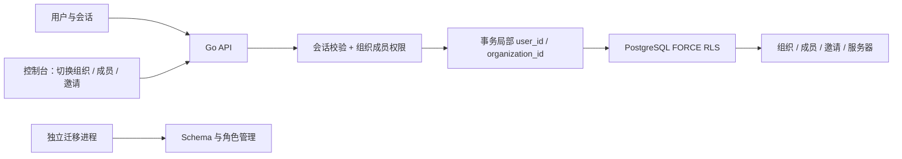

# SaaS 与组织多租户

星渡采用共享 PostgreSQL 数据库、共享 schema、按组织行级隔离的模块化单体。用户是全局身份，组织是租户；一个用户可以属于多个组织。自托管和未来托管服务使用同一套模型。

## 已实现的数据模型

- `users`：全局登录身份；原 `admins` 原地迁移，密码摘要与会话保留。
- `sessions`：全局认证会话；组织权限在每次业务请求时检查，不存入 Cookie。
- `organizations`：租户及创建者。
- `memberships`：用户与组织的多对多关系及角色，每组织固定一名所有者。
- `hosts`：必须归属于组织；地址与 SSH 端口唯一性限定在组织内。
- `invitations`：属于组织，固定目标角色，保存令牌摘要、有效期及消费/撤销状态。

旧账号成为默认组织所有者，已有服务器归入默认组织。若旧库存在服务器但没有管理员，迁移会失败并回滚，须先在旧版本创建管理员，不会丢弃服务器数据。

## 权限

| 操作 | 所有者 | 管理员 | 成员 | 只读成员 |
| --- | --- | --- | --- | --- |
| 查看服务器、成员 | 是 | 是 | 是 | 是 |
| 增删改服务器 | 是 | 是 | 是 | 否 |
| 邀请成员、只读成员 | 是 | 是 | 否 | 否 |
| 邀请管理员 | 是 | 否 | 否 | 否 |
| 修改/移除普通成员 | 是 | 是 | 否 | 否 |
| 修改/移除管理员 | 是 | 否 | 否 | 否 |
| 修改/移除所有者 | 否 | 否 | 否 | 否 |

任何已登录用户可创建自己的组织。所有者转移、组织删除、账号恢复和邮箱验证尚未实现。

## 数据库隔离

API 与 Worker 使用独立 `xingdu_app` 登录角色，无超级用户、BYPASSRLS、建库、建角色、建表权限，也不是表所有者。API 启动时拒绝特权连接。仅迁移服务持有数据库管理凭据。

组织相关表启用 `ENABLE ROW LEVEL SECURITY` 与 `FORCE ROW LEVEL SECURITY`。每次业务操作开启事务，通过 `set_config(..., true)` 设置本次用户和组织；提交或回滚后上下文自动清除，避免连接池串租户。HTTP 中的组织 ID 只是选择器，用户 ID 始终来自服务端会话，写操作同时经过成员权限校验和数据库策略。

成员 RLS 使用固定 search_path 的只读 SECURITY DEFINER 函数读取当前用户的角色，避免策略递归。函数由专用 `xingdu_policy` NOLOGIN 角色拥有：仅有成员表 SELECT 权限和 BYPASSRLS；运行账号没有该角色的成员资格，不能切换至该角色。函数不接受用户 ID 参数、不执行动态 SQL，并撤销 PUBLIC 执行权限。

全局身份与会话表属于认证子系统，不通过租户 RLS 隔离；不得将其查询接口暴露为通用数据 API。RLS 保护业务行访问，不能替代应用认证或防御运行数据库凭据泄漏。PostgreSQL 的超级用户可绕过 RLS，因此迁移凭据不得进入 API/Worker。参见 [PostgreSQL 17 官方文档](https://www.postgresql.org/docs/17/ddl-rowsecurity.html)。

当前使用组织级事务 advisory lock 串行化权限变更与业务访问，确保成员移除提交后的请求立即失去权限；后续高并发场景可细化锁粒度，不能破坏撤权与邀请消费的原子性。

## 邀请与注册

管理员生成 256-bit 随机邀请链接，数据库仅保存 SHA-256 摘要。链接固定角色、7 天有效、单次消费、可撤销；重复接受、过期和撤销均失败，已有成员不能借邀请升级角色。接受流程和成员写入在同一事务中完成。

邀请是**持有链接即可接受**的邀请，不绑定邮箱。管理员需私下发送给目标成员；当前不会代发邮件。令牌放在 URL fragment 中，避免进入普通 HTTP 访问日志；用户登录后主动确认接受，成功后清除 fragment。链接只在创建时显示，列表不返回原始令牌或摘要。

`XINGDU_REGISTRATION_ENABLED=false` 默认关闭公开注册；部署者设为 `true` 后显示注册入口。新用户注册会创建个人组织，也可以随后接受邀请加入其他组织。关闭公开注册时，可用 `admin` CLI 创建多个用户，每个新用户有自己的初始组织。不要将 CLI 暴露为公开 API。

## 后续边界

当前为 SaaS 架构开发预览，尚未完成公网运营：邮件验证/恢复、分布式限流、组织资源配额、审计日志、计费、备份恢复和运维监控仍需落地。Compose 继续仅绑定本机。

后续线路、部署、凭据、订阅与任务都必须携带 `organization_id`；租户内关联使用 `(organization_id, id)` 复合外键。Worker 领取任务后必须显式恢复组织上下文；Agent 身份只授权所属组织和服务器。不可直接复用管理员跨组织连接执行任务。

## 验证

数据库集成测试使用真实低权限运行角色，覆盖漏写 WHERE 的 RLS 查询、跨组织 CRUD、跨组织唯一性、缺失上下文与连接池清理、角色边界、撤销权限及邀请过期/撤销/重放。HTTP 集成测试覆盖注册、会话、组织选择、邀请接受、角色变更和成员移除。
